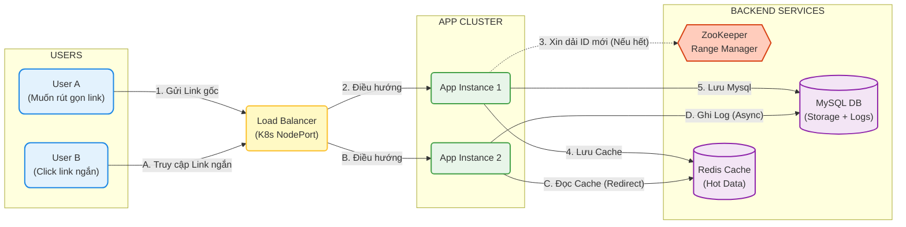

# 🚀 High-Performance Distributed URL Shortener


Hệ thống rút gọn liên kết (URL Shortener) hiệu năng cao, được thiết kế để xử lý lượng truy cập lớn (Scalable), sử dụng kiến trúc **Distributed Counter** với **Apache ZooKeeper**. Dự án minh họa cách giải quyết bài toán sinh ID duy nhất trong môi trường phân tán.

---

## 🛠 Công nghệ sử dụng

| Thành phần | Công nghệ |
| :--- | :--- |
| **Backend** | Java 17, Spring Boot 3 |
| **Database** | MySQL 8.0 |
| **Cache** | Redis |
| **Coordination** | Apache ZooKeeper 3.9 |
| **Testing** | JUnit 5, Testcontainers |
| **Infrastructure** | Docker, Docker Compose, Kubernetes (K8s) |
| **Frontend** | Thymeleaf, Bootstrap 5 |

---

## 🏗 Kiến trúc hệ thống (Distributed ID Strategy)



Dự án giải quyết vấn đề cốt lõi của hệ thống phân tán: **Làm sao để sinh ID duy nhất (Unique ID) trên nhiều server chạy song song mà không cần phụ thuộc vào Database (tránh nút thắt cổ chai)?**

### Luồng hoạt động chính:
1.  **ZooKeeper (Range Manager):** Đóng vai trò là người quản lý cấp phát dải số. Nó chia các dải ID (ví dụ: 1-1000, 1001-2000) cho các Application Server.
2.  **Application Server (Java):** Mỗi server xin một dải số từ ZooKeeper về và lưu trong RAM. Khi có request, nó tự tăng ID trong RAM -> **Tốc độ cực nhanh (Microsecond)** vì không cần gọi mạng liên tục.
3.  **Redis (Cache Layer):** Lưu trữ cặp `ShortCode - LongURL` để phục vụ chuyển hướng (Redirect) với tốc độ đọc cực cao.
4.  **MySQL (Storage Layer):** Lưu trữ bền vững dữ liệu URL và Logs (Analytics).
5.  **Async Analytics:** Sử dụng cơ chế xử lý bất đồng bộ (Queue trong RAM) để ghi nhận lượt click, đảm bảo không làm chậm trải nghiệm người dùng.

---

## 🚀 Hướng dẫn chạy (Run & Deploy)

### Cách 1: Chạy bằng Docker Compose (Khuyên dùng cho Local)
Cách nhanh nhất để bật toàn bộ hệ thống (App + MySQL + Redis + ZK).

**Bước 1: Build file JAR**
```bash
mvn clean package -DskipTests

```

**Bước 2: Khởi chạy hệ thống**

```bash
docker-compose up -d --build

```

**Bước 3: Truy cập**

* **Web UI:** http://localhost:8080
* **API Endpoint:** `http://localhost:8080/api/shorten`

---

### Cách 2: Deploy lên Kubernetes (Production Ready)

Dành cho môi trường Production hoặc Docker Desktop (K8s enabled).

**Yêu cầu:** Đã cài đặt `kubectl` và bật Kubernetes.

**Bước 1: Nạp cấu hình & Hạ tầng**

```bash
kubectl apply -f k8s/01-config.yaml
kubectl apply -f k8s/02-dependencies.yaml

```

*(Đợi 1-2 phút để Pod MySQL và Zookeeper khởi động)*

**Bước 2: Deploy ứng dụng**

```bash
kubectl apply -f k8s/03-app.yaml

```

**Bước 3: Truy cập**
Hệ thống sử dụng `NodePort` tại cổng **30000**.

* **Web UI:** http://localhost:30000

---

### Cách 3: Môi trường Dev (IntelliJ IDEA)

Dùng để debug code Java.

1. Chạy hạ tầng nền bằng Docker:
```bash
docker-compose up -d mysql redis zookeeper

```


2. Mở IntelliJ IDEA và chạy file `UrlShortenerApplication.java`.
3. Truy cập: http://localhost:8080

---

## 🔌 API Documentation

### 1. Rút gọn URL

* **Endpoint:** `/api/shorten`
* **Method:** `POST`
* **Content-Type:** `application/json`

**Request:**

```json
{
  "longUrl": "[https://www.youtube.com/watch?v=dQw4w9WgXcQ](https://www.youtube.com/watch?v=dQw4w9WgXcQ)"
}

```

**Response:**

```json
{
  "shortUrl": "http://localhost:8080/1a",
  "originalUrl": "[https://www.youtube.com/watch?v=dQw4w9WgXcQ](https://www.youtube.com/watch?v=dQw4w9WgXcQ)"
}

```

### 2. Truy cập Link (Redirect)

* **Endpoint:** `/{shortCode}`
* **Method:** `GET`
* **Behavior:** Trả về HTTP 302 (Found) và chuyển hướng tới link gốc. Ghi log analytics bất đồng bộ.

---

## 🧪 Testing

Dự án sử dụng **Testcontainers** để giả lập môi trường thực tế (MySQL, Redis, ZK).

Để chạy toàn bộ test case:

```bash
mvn test

```

---

## 📂 Cấu trúc dự án

```
├── src/main/java/com/example/urlshortener
│   ├── config/          # Cấu hình ZK, Redis
│   ├── controller/      # API Layer & Web View
│   ├── dto/             # Data Transfer Objects
│   ├── entity/          # JPA Entities (MySQL tables)
│   ├── manager/         # Zookeeper Range Manager (Core Logic)
│   ├── repository/      # Repository Interface
│   ├── service/         # Business Logic
│   └── util/            # Base62 Encoder
├── k8s/                 # Các file cấu hình Kubernetes
├── docker-compose.yml   # Cấu hình Docker Compose
├── Dockerfile           # Cấu hình build Image
└── pom.xml              # Dependencies Management

```

---

## 📑 Phân tích & Thiết kế Hệ thống

<details>
<summary><b>Click để xem chi tiết Yêu cầu & Use Cases</b></summary>

### 1. Các trường hợp sử dụng (Use Cases)

* **Mạng xã hội:** Tiết kiệm ký tự bài đăng, theo dõi CTR.
* **Tiếp thị liên kết:** Theo dõi hiệu quả chiến dịch, tăng độ tin cậy.
* **Email Marketing:** Tránh làm vỡ bố cục email bởi link dài.
* **Mã QR:** Giảm độ phức tạp mã QR giúp quét nhanh hơn.
* **Truyền thông in ấn:** Link ngắn dễ nhớ, dễ gõ lại từ tờ rơi/biển bảng.
* **Nội bộ doanh nghiệp:** Chia sẻ tài nguyên dễ dàng.
* **Mobile App:** Deep linking, tối ưu hiển thị trên màn hình nhỏ.
* **Branding:** Tăng nhận diện thương hiệu.

### 2. Yêu cầu chức năng

1. **Rút gọn:** Input URL dài -> Output URL ngắn duy nhất.
2. **Redirect:** Truy cập URL ngắn -> Chuyển hướng về URL gốc.
3. **Tính duy nhất:** Không được trùng lặp ID.

### 3. Yêu cầu phi chức năng (Quy mô lớn)

* **Tính khả dụng (Availability):** Uptime 99.9%.
* **Khả năng mở rộng (Scalability):** Hỗ trợ 100M người dùng, chịu tải đột biến (Spike traffic).
* **Độ trễ (Latency):** Read/Write cực nhanh.
* **Tính nhất quán (Consistency):**
* Cùng URL ngắn -> Luôn ra cùng URL dài.
* Cùng URL dài -> Nên trả về cùng URL ngắn (Idempotency).


* **Độ bền (Durability):** Dữ liệu không bao giờ bị mất.

</details>

---

## 🤝 Contributing

Pull requests are welcome. For major changes, please open an issue first to discuss what you would like to change.

```

```